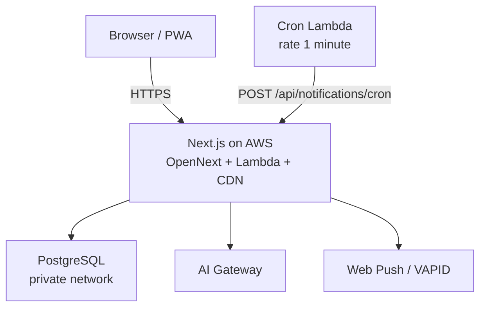

# Building My Bookkeeping App · 自製記帳本

<BilingualParagraph
  en="I started a new job and decided it was time to get serious about saving. Spreadsheets alone were not enough — I wanted a clearer picture of my finances, and a personal finance AI agent that could explain the numbers in plain language. So I built a small bookkeeping web app (PWA) for myself: income and expense, categories, multi-currency (default HKD), subscriptions, scheduled entries, budgets, savings goals, receipt OCR, and a chat assistant that can summarise my own ledger. The agent speaks in a light, teasing tone — it ribs me a little — so I actually pay more attention to money."
  zh="轉職之後，我想開始認真儲蓄。單靠試算表並不夠——我希望更清楚掌握自己的財務狀況，並打造一個個人理財 AI agent，用通俗語言解釋數字。於是我為自己做了一個輕量的記帳 Web App（PWA）：收支、分類、多貨幣（預設 HKD）、訂閱、排程記帳、預算、儲蓄目標、收據 OCR，以及一個可以總結自己帳目的聊天助手。這個助手語氣輕鬆、帶點調侃，偶爾會「串」我一下，反而令我更重視金錢。"
/>

## Why I built it · 為何要自己做

<BilingualParagraph
  en="The trigger was personal: a new salary, a new chance to save, and a desire to understand my cashflow without fighting generic finance apps that assume a different calendar, currency, or workflow. I also wanted features that match how I actually spend — Netflix-style subscriptions that only create a transaction on the billing day, scheduled copies for daily or weekday habits — plus an agent that makes the numbers stick by teasing me when I overspend."
  zh="觸發點很個人：新工作、新的儲蓄機會，以及想弄清楚自己的現金流，而不必與假設另一套日曆、貨幣或流程的通用理財 App 周旋。我也希望功能貼近真正用法——例如 Netflix 類訂閱只在扣款當日才產生交易、排程複製每日或指定星期的習慣開支——再加上一個會在我揮霍時以調侃語氣提醒我的 agent，令數字更容易記在心上。"
/>

<BilingualSolutionList
  items={[
    {
      enLabel: "Save with clarity",
      en: "See where money goes, what recurs, and how much is left — so saving is a habit, not a guess.",
      zhLabel: "儲蓄要看得見",
      zh: "看清錢花到哪裏、有哪些循環扣款、還剩多少——儲蓄才是習慣，而非憑感覺。",
    },
    {
      enLabel: "HK-first time logic",
      en: "Cron, subscription billing days, and notification schedules all follow Asia/Hong_Kong.",
      zhLabel: "以香港時區為準",
      zh: "排程、訂閱扣款日與推送提醒一律依照 Asia/Hong_Kong。",
    },
    {
      enLabel: "An agent that ribs me",
      en: "Light, teasing tone on purpose — clearer answers, and a nudge to take money seriously.",
      zhLabel: "會「串」我的助手",
      zh: "刻意用輕鬆、帶點調侃的語氣——解釋更清楚，也促使我更認真看待金錢。",
    },
  ]}
/>

## What it does · 功能一覽

<Table
  caption="Core capabilities · 核心能力"
  columns={[
    { key: "area", header: "Area · 範疇" },
    { key: "capability", header: "Capability · 能力" },
  ]}
  data={[
    {
      area: "Core ledger · 核心記帳",
      capability:
        "Income / expense, categories, multi-account, multi-currency (default HKD). 收入／支出、分類、多帳戶、多貨幣（預設 HKD）。",
    },
    {
      area: "Subscriptions · 訂閱",
      capability:
        "Recurring charges; a transaction is created only on the billing day — future periods are not pre-generated. 循環扣款；只在扣款當日產生交易，不會預先生成未來期數。",
    },
    {
      area: "Schedules · 排程交易",
      capability:
        "Clone a transaction into daily / weekday auto-entries via cron. 由一筆交易複製成每日／指定星期，由排程自動記帳。",
    },
    {
      area: "Budgets & savings · 預算／儲蓄",
      capability:
        "Parent-category budgets and savings goals. 按分類父層設定預算與儲蓄目標。",
    },
    {
      area: "Sharing · 帳戶共享",
      capability:
        "Account owners can share write access with other users; invite tokens gate registration. 帳戶主人可分享寫入權；邀請 token 控制註冊。",
    },
    {
      area: "AI & OCR · AI／收據",
      capability:
        "Chat agent with read-only tools; separate receipt parse API via Grok vision. Chat agent（以讀取為主）；收據解析走獨立 API。",
    },
    {
      area: "PWA & push · PWA／推送",
      capability:
        "Add to home screen; daily reminder and pre-billing Web Push (VAPID). 可加至主畫面；每日記帳提醒與扣款前提醒。",
    },
  ]}
/>

## Three-step bookkeeping · 三步記帳

<BilingualParagraph
  en="The entry flow is deliberately short. I did not want a dense form that asks for everything at once — just three taps that match how I already think about a spend."
  zh="記帳流程刻意保持簡短。我不希望一張大表一次問盡所有欄位——只要三步，對齊我本來如何理解一筆開支。"
/>

<BilingualSolutionList
  items={[
    {
      enLabel: "Step 1 — Category",
      en: "Pick what the money was for (food, transport, tools…). Category first keeps budgets and reports meaningful.",
      zhLabel: "步驟 1 — 選分類",
      zh: "先選擇這筆錢的用途（飲食、交通、工具等）。分類先行，預算與報表才有意義。",
    },
  ]}
/>

<BilingualSolutionList
  items={[
    {
      enLabel: "Step 2 — Account",
      en: "Choose which wallet or card paid — cash, bank, credit card, or a shared account.",
      zhLabel: "步驟 2 — 選帳戶",
      zh: "再選擇以哪個錢包或卡支付——現金、銀行、信用卡，或共享帳戶。",
    },
  ]}
/>

<BilingualSolutionList
  items={[
    {
      enLabel: "Step 3 — Amount",
      en: "Enter the number (and optional note / receipt). Done — back to life.",
      zhLabel: "步驟 3 — 填金額",
      zh: "輸入金額（可選備註／收據）。完成後即可返回日常。",
    },
  ]}
/>

## Architecture at a glance · 架構速覽

<BilingualParagraph
  en="The stack is intentionally boring where it should be, and opinionated where money logic matters. The UI is Next.js (App Router) + React + Tailwind + TanStack Query. Data lives in PostgreSQL behind Prisma. Auth is a signed cookie session; middleware injects the current user onto requests. Production runs on AWS via SST (OpenNext), inside a VPC so the app can reach a private database. A one-minute cron Lambda hits an authenticated notifications endpoint that syncs due subscriptions, due schedules, and Web Push."
  zh="技術棧在應當「平淡」之處保持平淡，在金錢語意需要清晰之處則寫死規則。前端使用 Next.js（App Router）、React、Tailwind 與 TanStack Query；資料使用 PostgreSQL 與 Prisma；認證為 signed cookie session，由 middleware 注入當前用戶。生產環境以 SST（OpenNext）部署至 AWS，運行於 VPC 內以便連接私網資料庫。每分鐘一個 Cron Lambda 會帶上 secret 呼叫通知 API，一次同步到期訂閱、排程交易與 Web Push。"
/>

### Tech stack · 技術棧

<Table
  caption="Layers and choices · 分層與選擇"
  columns={[
    { key: "layer", header: "Layer · 層" },
    { key: "choice", header: "Choice · 技術" },
  ]}
  data={[
    {
      layer: "App · 應用",
      choice: "Next.js App Router, React, Tailwind CSS 4, TanStack Query",
    },
    {
      layer: "API · 介面",
      choice: "Route Handlers under app/api — auth, ledger, reports, chat, OCR, notifications",
    },
    {
      layer: "Data · 資料",
      choice: "Prisma + PostgreSQL (connection pool kept small for serverless)",
    },
    {
      layer: "Auth · 認證",
      choice: "Cookie session (SESSION_SECRET); x-user-id injected in middleware",
    },
    {
      layer: "AI · 智能",
      choice: "Vercel AI SDK ToolLoopAgent; chat tools scoped to the signed-in user; receipt OCR via xAI Grok",
    },
    {
      layer: "Deploy · 部署",
      choice: "SST v4 → AWS; OpenNext; streaming wrapper for chat SSE",
    },
  ]}
/>

## Business rules that matter · 幾條重要業務規則

<BilingualParagraph
  en="Most of the product is CRUD. The parts I cared about designing carefully are the ones that create money rows automatically."
  zh="產品大部分是 CRUD；我特別用心設計的，是會「自動產生交易」的那幾條規則。"
/>

<BilingualSolutionList
  items={[
    {
      enLabel: "Subscriptions are lazy",
      en: "Do not pre-create next month's Netflix rows. On billing day (cron or create-on-due-day), insert one transaction; repeated sync skips if that period already exists.",
      zhLabel: "訂閱延遲產生",
      zh: "不會預先塞滿未來月份。只在扣款當日插入一筆；重複 sync／cron 會略過已存在的當期交易。",
    },
    {
      enLabel: "Schedules follow the same idea",
      en: "Daily / weekday schedules materialise on the day via cron — same dedupe mindset as subscriptions.",
      zhLabel: "排程同一套語意",
      zh: "每日／星期設定由 cron 於當日產生交易，同樣避免重複。",
    },
    {
      enLabel: "Dates are calendar days",
      en: "Transaction dates are stored as date strings aligned to Hong Kong calendar logic, not naive UTC midnight tricks.",
      zhLabel: "日期跟日曆日",
      zh: "交易 date 多用字串日期，配合香港日曆日，而非依賴純 UTC DateTime 取巧。",
    },
    {
      enLabel: "Chat is read-mostly",
      en: "Agent tools query accounts, transactions, budgets, subscriptions, trends, and progressive skills. Writing money still goes through the normal UI/API — lower hallucination risk.",
      zhLabel: "Chat 以讀為主",
      zh: "Agent tools 查詢帳戶、交易、預算、訂閱、趨勢與 skills；寫帳仍走正常 UI／API，降低幻覺亂寫帳的風險。",
    },
  ]}
/>

## AI assistant shape · AI 助手如何組成

<BilingualParagraph
  en="Chat is a ToolLoopAgent with a short instruction stack (identity / soul / user context) plus a skill catalog — including a deliberately light, teasing voice so the feedback sticks. On each request it can load a skill for multi-step guidance (period summary, cashflow trends, account health, subscription review), then call scoped tools. Receipt parsing is a separate vision endpoint — not routed through the chat agent — so OCR stays a focused pipeline."
  zh="Chat 使用 ToolLoopAgent：簡短 instruction（identity／soul／用戶脈絡）加上 skills 目錄——並刻意設定輕鬆、帶點調侃的語氣，令提醒更容易記在心上。每次請求可以先 loadSkill 取得完整步驟（期間總結、現金流趨勢、帳戶健康、訂閱檢視），再呼叫其他 scoped tools。收據解析是獨立視覺 API，不經 chat agent，使 OCR 保持一條清晰管道。"
/>

## Design trade-offs · 設計取捨

<Table
  caption="Why these choices · 為何如此選擇"
  columns={[
    { key: "decision", header: "Decision · 取捨" },
    { key: "why", header: "Why · 原因" },
  ]}
  data={[
    {
      decision: "Serverless Next on AWS (SST + OpenNext) · Serverless Next 上 AWS",
      why: "Coexist with an existing private Postgres; chat needs a streaming wrapper so SSE flushes chunk-by-chunk. 與既有私網 Postgres 共存；chat 需要 streaming wrapper 才能逐塊 flush。",
    },
    {
      decision: "Cron hits own HTTP API · Cron 呼叫自家 HTTP",
      why: "Business logic stays in Next route handlers; the invoker Lambda only authenticates and triggers. 業務邏輯集中於 Next API；Invoker 只負責帶 secret 觸發。",
    },
    {
      decision: "Lazy subscription rows · 訂閱延遲產生交易",
      why: "Avoid stuffing the ledger with future months the user never opened. 避免預先塞滿用戶從未開啟過的未來月份。",
    },
    {
      decision: "Read-only agent tools · Agent 以讀為主",
      why: "Summaries and Q&A without letting the model invent ledger writes. 可以總結與問答，但不讓模型擅自寫帳。",
    },
    {
      decision: "Secrets via SST Secret · 密鑰使用 SST Secret",
      why: "Keys stay out of the repo; local uses .env and an SSH tunnel to the private DB. 密鑰不寫入 repo；本地使用 .env 與 SSH tunnel 連接私網 DB。",
    },
  ]}
/>

## What I use it for day to day · 日常如何使用

<BilingualParagraph
  en="On a normal day I glance at the dashboard, log meals or transport, and let the evening push nudge me if I forgot. Subscriptions and schedules keep recurring noise out of my head. When I want a narrative — 'how did dining look this month?' — I ask the chat instead of exporting a sheet. None of this replaces banking apps; it replaces the fog between bank rows and a decision."
  zh="平常日子我會看一眼儀表板、記錄飲食或交通；若忘記了，晚上的推送會提醒我。訂閱與排程讓我不必在腦中記住循環雜務。想要敘事式答案——例如「這個月飲食情況如何？」——便問 chat，而不必先匯出試算表。它並不取代銀行 App；它取代的是銀行明細與決策之間那層霧。"
/>

## Takeaways · 小結

<BilingualSolutionList
  items={[
    {
      enLabel: "Build for your calendar",
      en: "Personal finance software that ignores timezone and billing-day semantics fights you every month.",
      zhLabel: "為你的日曆而做",
      zh: "無視時區與扣款日語意的理財工具，每個月都會與你拉鋸。",
    },
    {
      enLabel: "Automate the boring create",
      en: "Subscriptions and schedules should materialise on the day — not invent a year of fake future rows.",
      zhLabel: "自動化那些沉悶的「新增」",
      zh: "訂閱與排程應在當日才落地，而非預先發明一年的未來假資料。",
    },
    {
      enLabel: "AI as lens, not ledger writer",
      en: "Let the model read and explain; keep writes on the proven form/API path.",
      zhLabel: "AI 是鏡頭，不是記帳員",
      zh: "讓模型閱讀與解釋；寫入仍然走已驗證的表單／API。",
    },
  ]}
/>

<BilingualParagraph
  en="This started as a selfish tool for a new chapter at work. Shipping it taught me more about product boundaries than another tutorial CRUD app would have — especially around time, recurrence, and what an agent should never be allowed to invent."
  zh="這個項目起初只是為自己轉職後管錢而做。真正 shipped 之後，我學到的產品邊界，遠多於再做一個教學式 CRUD——尤其是時間、循環扣款，以及 AI agent 絕對不應擅自發明的東西。"
/>
