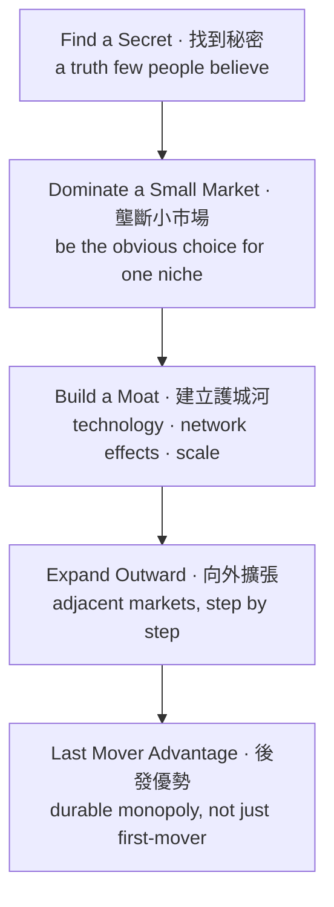

# Zero to One · 從 0 到 1（工程師視角）

<BilingualParagraph
  en="I'm a software developer who's been thinking about starting something of my own, so I picked up Zero to One by Peter Thiel (with Blake Masters, based on Thiel's Stanford class CS183) hoping for a founder's mental model, not just startup clichés. The core thesis stuck with me immediately: writing another CRUD app or cloning an existing SaaS only takes the world from 1 to n; the real win is going from 0 to 1 — shipping something that didn't exist before."
  zh="我是一個一直在想「要不要創業」的軟件工程師，所以找來彼得・提爾（Peter Thiel）的《從 0 到 1》（與 Blake Masters 合著，源自提爾在史丹佛開的創業課 CS183）想看的不是一堆創業口號，而是一套創辦人的思考框架。書中核心主張一開始就打中我：再寫一個 CRUD app、或者抄一個已存在的 SaaS，只是把世界從 1 帶到 n；真正的突破是從 0 到 1——做出一個從未存在過的東西。"
/>

## Reading it as a developer, not a business major · 用工程師（而非商科生）的角度閱讀

<BilingualParagraph
  en="A lot of startup books are written for people with an MBA vocabulary — market sizing, TAM/SAM/SOM, go-to-market. Zero to One is refreshingly different: Thiel talks about secrets, monopolies, and definite plans in a way that feels closer to how engineers already think — find an unsolved problem, understand why it's unsolved, and build a precise solution for it. As a developer used to reasoning from first principles about code, this framing of business as 'what non-obvious truth have you found?' felt very natural."
  zh="很多創業書都是用 MBA 的語言寫的——市場規模、TAM/SAM/SOM、go-to-market 策略。《從 0 到 1》難得地不太一樣：提爾談的是秘密、壟斷、明確的計劃，這種思考方式反而更貼近工程師本來的思維習慣——找出一個未被解決的問題，理解它為何未被解決，然後針對它做出精準的解決方案。對於習慣用第一性原理思考程式碼的工程師來說，把商業問題重新框成『你發現了什麼不明顯的真相？』其實相當自然。"
/>

## Key Terms · 關鍵概念

<Table
  caption="Core concepts from the book · 書中核心概念"
  columns={[
    { key: "term", header: "Term" },
    { key: "meaning", header: "Meaning" },
  ]}
  data={[
    {
      term: "Zero to One · 從 0 到 1",
      meaning:
        "Creating something new that didn't exist before, as opposed to horizontal progress (1 to n) that just copies existing ideas — e.g. building a genuinely new tool vs. shipping the 50th to-do app. 創造出前所未有的新事物，相對於只是複製既有做法的水平擴張（1 到 n）——例如做出一個真正新穎的工具，而不是第 50 個待辦事項 app。",
    },
    {
      term: "Monopoly · 壟斷",
      meaning:
        "A company so far ahead in its niche that it captures outsized value. For a solo developer, this often means picking a niche so specific that no existing SaaS serves it well. 在某個利基市場遙遙領先、能獲取超額價值的公司。對獨立開發者來說，這通常代表選一個夠細分的市場，細到現有 SaaS 都服務得不夠好。",
    },
    {
      term: "Secrets · 秘密",
      meaning:
        "An important truth few people believe. For engineers, this is often a technical insight from working close to a problem: 'this workflow is painful and everyone just tolerates it.' 少數人相信的重要真相。對工程師來說，這往往是因為近距離接觸某個問題而發現的技術洞見：『這個流程很痛苦，但大家都在忍受』。",
    },
    {
      term: "Definite optimism · 明確的樂觀主義",
      meaning:
        "Having an actual plan for the future, not just 'ship an MVP and see what happens.' Relevant for devs tempted to skip planning and jump straight to code. 對未來有具體計劃，而不是只想著『先做個 MVP 看看情況』。對於習慣直接跳去寫程式、跳過規劃的工程師特別有參考價值。",
    },
    {
      term: "Technical moat vs. distribution moat · 技術護城河 vs. 分銷護城河",
      meaning:
        "Thiel warns that great technology alone (a favorite developer instinct) isn't enough — distribution and sales matter just as much as the product itself. 提爾提醒，光有優秀的技術（工程師最容易迷戀的部分）並不足夠——分銷與銷售能力和產品本身同樣重要。",
    },
    {
      term: "Power law · 冪次法則",
      meaning:
        "A small number of companies capture most of the value. Useful context for why 'building something small and stable' and 'building a startup' are different games with different risk profiles. 少數公司會捕獲絕大部分的價值。這解釋了為何『做一個穩定的小生意』和『做一間新創公司』是兩種完全不同、風險特徵也不同的遊戲。",
    },
  ]}
/>

## Thiel's monopoly-building path · 提爾的壟斷成長路徑

## Three principles I'm taking into my own attempt · 三個我會帶入自己創業嘗試的原則

<BilingualParagraph
  en="Out of everything in the book, three ideas are the ones I keep coming back to as a developer actually weighing whether to start something."
  zh="書中眾多想法之中，有三個是我作為一個真的在考慮創業的工程師，會不斷回頭去想的。"
/>

<BilingualSolutionList
  items={[
    {
      enLabel: "1. Find the secret",
      en: "Before writing code, Thiel pushes you to find a secret — an important truth about a problem that almost nobody else believes or has noticed. For a developer, this usually isn't a grand scientific discovery; it's something small and concrete you've noticed from being close to the problem, e.g. 'the tools everyone uses for X quietly fail in this one specific way, and nobody has bothered to fix it.' If you can't state your secret in one sentence, you probably don't have one yet — you just have an idea for a product.",
      zhLabel: "1. 找到那個秘密（Find the secret）",
      zh: "在寫任何一行程式碼之前，提爾要求你先找到一個「秘密」——一個關於某個問題、幾乎沒有人相信或注意到的重要真相。對工程師來說，這通常不是什麼偉大的科學發現，而是因為近距離接觸問題而發現的、很具體的小事，例如：『大家用來做 X 的工具，都在這個特定的地方悄悄失效，而且沒人肯花時間去修』。如果你沒辦法用一句話講出你的秘密，那你可能還沒找到秘密——你只是有一個產品的點子而已。",
    },
    {
      enLabel: "2. The advantage needs to be 10x, not 10%",
      en: "Thiel is explicit that a better solution needs to be at least 10x better than existing alternatives on some dimension — not marginally nicer UI or 10% faster. This is a hard check for developers: it's tempting to ship something because we can build it, or because our version is 'cleaner code,' but users don't switch tools for a 10% improvement. If the honest answer is 'it's about the same as what's already out there, just built by me,' that's a signal to keep searching, not to keep coding.",
      zhLabel: "2. 優勢要有十倍以上，而不是 10%",
      zh: "提爾明確指出，一個更好的解決方案，必須在某個面向上比現有選項好上至少十倍——而不是介面好看一點、或快 10% 而已。這對工程師是個嚴格的檢查點：我們很容易因為「這個我做得出來」或「我這版的程式碼比較乾淨」就動手，但用戶不會為了 10% 的進步而換工具。如果誠實檢視後，答案是『其實跟現有的東西差不多，只是換成我做而已』，那代表應該繼續尋找，而不是繼續寫程式。",
    },
    {
      enLabel: "3. Start at the small market",
      en: "Thiel's advice is to dominate a small, specific market first — not launch broad and hope to capture a sliver of a huge market. For a solo developer, this means picking an audience narrow enough that you can realistically become the obvious choice for them (e.g. 'freelance video editors who use X tool' rather than 'creators'), then expanding outward once you've actually won that small market.",
      zhLabel: "3. 從小市場開始（Start at the small market）",
      zh: "提爾的建議是先在一個小而具體的市場稱霸——而不是一開始就面向廣大市場、指望能吃到一大塊市場裡的一小片。對獨立開發者而言，這代表要挑一個夠窄的受眾，窄到你有機會真正成為他們心目中的首選（例如『用某個工具的接案影片剪輯師』，而不是泛泛的『內容創作者』），等真正贏下這個小市場之後，再逐步向外擴張。",
    },
  ]}
/>

## What resonates as a dev who codes side projects · 對有做 side project 的工程師特別有感的部分

<BilingualSolutionList
  items={[
    {
      enLabel: "Stop copying, start asking 'why hasn't this been solved?'",
      en: "Thiel pushes you past 'let me clone X but cheaper' toward finding a problem nobody has cracked yet — which usually means talking to real users, not just building what's technically interesting to you.",
      zhLabel: "停止複製，改問「為什麼這個問題還沒被解決？」",
      zh: "提爾要求你跳出『抄 X 但做便宜一點』的思維，去找一個還沒有人解決的問題——而這通常代表你要去跟真實用戶聊天，而不是只做自己覺得技術上有趣的東西。",
    },
    {
      enLabel: "Code is necessary but not sufficient",
      en: "As a developer, it's tempting to believe great engineering wins by itself. Thiel's monopoly framework is a reminder that distribution, sales, and positioning decide whether a 0 to 1 idea actually reaches users.",
      zhLabel: "程式碼是必要條件，但不是充分條件",
      zh: "作為工程師，很容易相信只要工程做得好就能贏。提爾的壟斷框架提醒我們：分銷、銷售與市場定位，才是決定一個從 0 到 1 的點子能否真正觸及用戶的關鍵。",
    },
    {
      enLabel: "Small market first, then expand",
      en: "The 'start with a monopoly in a small market, then scale' pattern maps well onto solo/indie dev strategy: ship for one very specific audience before trying to serve everyone.",
      zhLabel: "先做小市場的壟斷，再擴張",
      zh: "『先在小市場建立壟斷，再逐步擴張』這套打法，很適合套用在獨立開發者身上：先服務一個非常具體的受眾，之後才考慮擴大範圍。",
    },
    {
      enLabel: "Plan before you build, not just after a sprint retro",
      en: "Definite optimism challenged my habit of treating a side project as 'agile forever' — sometimes you need an actual multi-month plan, not just a backlog of tickets.",
      zhLabel: "動手做之前先規劃，而不是只靠 sprint retro 邊做邊改",
      zh: "『明確的樂觀主義』挑戰了我把 side project 當成『永遠 agile』的習慣——有時候你需要的是一份真正的、跨越數個月的計劃，而不只是一堆待辦事項（backlog）。",
    },
  ]}
/>

## Chapter highlights, with a developer's lens · 章節重點（附工程師的解讀）

<Table
  caption="Selected chapters and takeaways · 精選章節與重點"
  columns={[
    { key: "chapter", header: "Chapter · 章節" },
    { key: "takeaway", header: "Takeaway · 重點" },
  ]}
  data={[
    {
      chapter: "The Challenge of the Future · 未來的挑戰",
      takeaway:
        "Horizontal progress (copy, scale) vs. vertical progress (new tech, 0 to 1). For devs: shipping yet another clone is horizontal; solving something with a novel technical approach is vertical.（水平進步（複製、擴張）vs. 垂直進步（新科技、從 0 到 1）。對工程師而言：做又一個複製品是水平進步；用新穎的技術方法解決問題才是垂直進步。）",
    },
    {
      chapter: "All Happy Companies Are Different · 幸福的公司各有不同",
      takeaway:
        "Every monopoly solves a unique problem; competitive companies look alike. A useful gut-check before starting: 'if this succeeds, would it look meaningfully different from what's already out there?'（每個壟斷企業都解決獨特的問題；互相競爭的公司則彼此相似。開始前一個實用的自我檢查：『如果這成功了，它會跟現有的東西有明顯不同嗎？』）",
    },
    {
      chapter: "The Ideology of Competition · 競爭的意識形態",
      takeaway:
        "Competition is often more ideology than economics. Relevant warning for devs drawn into building 'yet another' tool in an already crowded space (e.g. the Nth project management app) just because it's a well-trodden, safe path.（競爭往往更像一種意識形態，而非經濟現實。這對工程師是個提醒：不要只因為某個賽道很多人做、感覺「安全」，就一頭栽進去做第 N 個專案管理工具。）",
    },
    {
      chapter: "Last Mover Advantage · 後發優勢",
      takeaway:
        "Being first to ship doesn't matter if you can't defend the position later. Good context for devs who move fast on execution but haven't thought about what keeps competitors out.（先推出產品不重要，重要的是之後能否守住位置。這對執行力很強、卻沒想清楚「如何阻擋競爭者」的工程師是個好提醒。）",
    },
    {
      chapter: "You Are Not a Lottery Ticket · 你不是一張彩券",
      takeaway:
        "Success isn't mostly luck — deliberate planning matters. Counters the 'just ship fast and see what sticks' instinct that's common in dev culture.（成功不是靠運氣——刻意的規劃很重要。這反駁了工程師文化中常見的『先快速上線，看看什麼能成』的直覺。）",
    },
    {
      chapter: "Founders · 創辦人",
      takeaway:
        "A candid look at founder eccentricity and power. Useful for a dev considering going solo: understand that being a founder is a different, more exposed role than being an individual contributor.（坦率談論創辦人的特立獨行與權力。對考慮單幹的工程師很有用：創辦人是一個比 IC（個人貢獻者）更暴露、責任也不同的角色。）",
    },
  ]}
/>

## Where the book falls short for a developer audience · 對工程師讀者來說，本書的不足之處

<BilingualParagraph
  en="Zero to One is light on execution — it won't tell you how to price a SaaS, write your first landing page, or find your first ten users, which is exactly the practical stuff a developer trying to go from 'side project' to 'startup' often needs most. It's also written from a very specific vantage point (PayPal, Palantir, venture-scale ambition), so its 'aim for monopoly' advice can feel like overkill if you just want to build a sustainable one-person SaaS rather than the next unicorn. Read it for the mental models, not for a step-by-step playbook — pair it with more tactical resources (e.g. indie hacker communities, pricing guides) for the how-to."
  zh="《從 0 到 1》在執行層面著墨不多——它不會教你如何為 SaaS 定價、寫第一個 landing page，或找到頭十個用戶，而這些恰恰是工程師想從『side project』走向『新創』時最需要的實務內容。此書也帶有非常特定的視角（PayPal、Palantir、追求創投規模的野心），所以『追求壟斷』的建議，對只想做一個能養活自己的獨立 SaaS、而非下一個獨角獸的人來說，可能顯得有點過火。建議把它當成思維模型來讀，而非一步步的操作手冊——實務上的『怎麼做』，還是要另外參考 indie hacker 社群或定價指南之類的資源。"
/>

## Takeaway · 小結

<BilingualParagraph
  en="As a developer eyeing my own startup, the biggest shift Zero to One gave me wasn't a checklist — it was a question to sit with before writing another line of code: what do I believe about a problem that almost nobody else does, and can I build something around that instead of around what's technically easy for me? I don't agree with every conclusion Thiel draws, especially the near-worship of monopoly, but the habit of asking that question before committing to a project is one I'm keeping."
  zh="作為一個正在考慮創業的工程師，《從 0 到 1》給我最大的改變，不是一份清單，而是一個在寫下下一行程式碼之前，值得先問自己的問題：關於某個問題，我相信著什麼幾乎沒人相信的事？我能否圍繞這個信念去打造東西，而不是圍繞『對我來說技術上比較容易』去打造東西？我不完全認同提爾的每一個結論，尤其是他對『壟斷』近乎推崇的態度，但在投入一個項目之前先問這個問題的習慣，我會保留下去。"
/>
