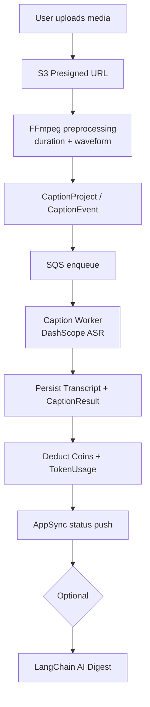
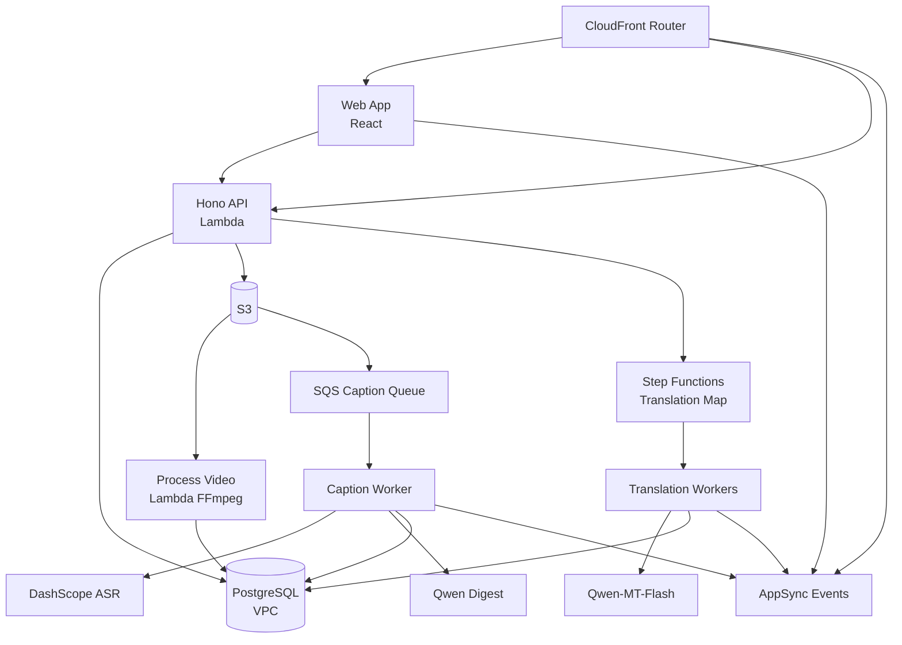

# Project Background

During my job search in **April–June 2026**, I built this as a **personal side project** — a pay-as-you-go SaaS for AI-driven multimedia captioning and transcription. The platform targets creators, podcasters, educators, and teams who need accurate, time-coded subtitles from audio or video.

The core product, **AI Transcribe**, supports file uploads, YouTube links, and automatic generation of SRT / VTT / TXT subtitles with optional AI summaries, tags, and multi-language translation. Users purchase **Coins** via **Polar.sh** and spend them on transcription and translation — Coins do not expire and are not tied to subscriptions. The same account and balance are designed to be shared across a growing suite of AI tools (Translator live; Summarizer, Voice, and Writer planned).

I delivered the project **end to end** (frontend, backend, and infrastructure): a **Turborepo monorepo** deployed with **SST + Hono + AWS**, integrating **Alibaba DashScope** (Qwen ASR / Qwen-MT) and **LangChain**, with **Better Auth**, **Prisma + PostgreSQL**, and a **Coin Ledger** for precise billing. The web UI was built with **AI-assisted development** (Cursor / LLM) to accelerate component and page output, while I owned architecture decisions, API integration, UX refinement, and production deployment.

# My Responsibilities

## Backend & Infrastructure

- Designed and shipped a **SST monorepo backend** with modular domains for captions, uploads, billing, coins, realtime, and admin — deployed on **AWS Lambda**, **SQS workers**, and **Step Functions**.
- Implemented REST APIs with **Hono + @hono/zod-openapi** covering caption project CRUD, transcription triggers, transcript editing, translation jobs, coin balance, and invoice queries.
- Integrated **DashScope File Transcription API** for speech-to-text and **LangChain + Qwen** for structured **AI Digest** output (title, summary, tags).
- Built a **subtitle translation pipeline** using **AWS Step Functions Map** to batch-invoke **Qwen-MT-Flash** for cue-level translation with optional preservation of proper nouns, place names, and person names.
- Implemented a **Coin Ledger** (grants, transactions, FIFO deduction by expiry) and **Polar webhooks** for traceable top-ups, consumption, and refunds.
- Configured **Better Auth** (email / OAuth) with **Polar Checkout** for sessions, roles, and payment flows.
- Provisioned **AWS infrastructure**: S3 storage, SQS queues, FFmpeg media preprocessing Lambda, AppSync Events for realtime updates, and VPC-hosted RDS access.
- Set up **GitHub Actions CI/CD** (`uat` / `prod` branch deploys) with Discord webhook notifications.

## Frontend (AI-Assisted Development)

- Built the full web app with **React 19 + TanStack Router/Start + Vite + Tailwind v4 + shadcn/ui** — home, dashboard, caption editor, translation, pricing, top-up, billing, and settings.
- Used **AI-assisted generation** (Cursor Agent, LLM) for UI components, layouts, and interaction logic; I handled **architecture, API wiring, state management, type safety, and final code review**.
- Integrated **Better Auth** sign-in, **Hono RPC client** for backend calls, and **AppSync Events** subscriptions for live transcription and translation status.
- Implemented **WaveSurfer.js** waveform playback with cue-level subtitle editing, multilingual routing (`en` / `zh-TW` / `ja` / `ko`), and SEO (sitemap, JSON-LD).
- Established brand visuals and homepage motion aligned with a multi-tool product roadmap.

# Key Contributions

## End-to-End Transcription Flow

- Modeled **CaptionProject → CaptionEvent → CaptionResult / Transcript** to support multiple transcript versions (AI vs. user-edited) and failure retries.
- SQS worker implements **stale processing claims** and **DLQ termination** so events do not stay stuck in `PROCESSING`.
- On transcription failure, **Coins are refunded automatically** so billing matches delivered service.

## AI Transcribe & AI Digest

- Backend supports **MP3 / WAV / M4A / MP4 / MOV / WebM**; frontend uses **WaveSurfer.js** for waveform display and cue editing.
- After ASR completes, the worker asynchronously calls **Qwen + LangChain** to produce **CaptionEventAiDigest** (title / summary / tags), with transcript fingerprinting for idempotent updates.
- Exports **SRT, VTT, and TXT** for direct upload to YouTube, Premiere, and similar platforms.

## Multilingual Subtitle Translation

- Users choose target languages (`zh-TW`, `en`, `ja`, `ko`, etc.) and **keepFlags** (terms / places / names).
- API triggers a **Step Functions state machine** that maps parallel **Translation Workers**, each batch calling **Qwen-MT-Flash**, then merges into a full `cuesPayload`.
- Progress streams to the web client via **AppSync Events** — no polling required.

## Coin Billing & Polar Integration

- **CoinAccount** caches balance; **CoinGrant** tracks expiry per top-up batch; **CoinTransaction** is an append-only ledger.
- Consumption uses **FIFO by expiry** from the soonest-expiring grants, with **CoinGrantConsumption** recording split details.
- **Polar `order.*` / `checkout.*` / `refund.*` webhooks** sync to **BillingInvoice**, including PDF invoice download.
- Transcription and translation are billed by **audio seconds / token usage**, with **TokenUsage** persisted for cost analysis.

## Realtime & Media Infrastructure

- **AWS AppSync Events API** exposes `/default/captions/{userId}` channels; workers and API publish project and translation status changes.
- **S3 ObjectCreated** triggers **Process Video Lambda**: FFmpeg probes duration, computes **waveformPeaks**, validates media limits, and writes **CaptionTmpUpload** metadata.
- A standalone **Rust / Axum** service (`youtube-to-wav`) uses yt-dlp to fetch YouTube audio, deployable as Lambda for dashboard trials.

## Frontend & Multilingual Experience

- Solo delivery of the web app: React 19, TanStack Router/Start, Vite, Tailwind v4, shadcn/ui.
- Workflow: **AI-generated first draft → manual API / state / types integration → UX iteration** for efficient single-developer SaaS delivery.
- English, Traditional Chinese, Japanese, and Korean routes with SEO (sitemap, JSON-LD FAQ).
- Pages: Home, Dashboard, Captions editor, AI Transcribe, AI Translator, Pricing, Top-up, Billing, Coin History, Settings, Blog.
- Frontend consumes backend OpenAPI and Hono RPC directly; AppSync subscriptions drive progress UI without a separate BFF.

## System Architecture

## Infrastructure & Security

- **SST v4** IaC for `dev` / `uat` / `prod` and personal stages.
- API Lambda in **VPC** for PostgreSQL; secrets injected via **SST Secret**.
- **Better Auth** session cookies protect authenticated APIs; OpenAPI 3.1 docs with Scalar UI.
- **CloudFront Router** as API entry; web app deployed as a separate SST stack.

## Technical Skills Demonstrated

- **Full-stack delivery (AI-assisted)**: Solo frontend, backend, and deployment; Cursor / LLM accelerated UI while retaining architecture control and production quality
- **Frontend**: React 19, TanStack Router/Start, shadcn/ui, WaveSurfer caption editing, i18n, Motion, SEO
- **Backend / API**: SST monorepo, Hono OpenAPI, modular domain handlers, Lambda + SQS async pipelines
- **AI / ML**: DashScope ASR, LangChain structured output, Qwen-MT batch translation, token usage tracking
- **Billing**: Coin ledger (FIFO expiry), idempotent Polar webhooks, PDF invoices
- **Cloud**: AWS orchestration (S3 / SQS / Step Functions / AppSync), SST IaC, VPC database access
- **Auth & payments**: Better Auth sessions, Polar Checkout integration
- **Realtime**: AppSync Events subscriptions, type-safe Hono RPC client
- **Media**: FFmpeg probe, waveform generation, YouTube audio extraction (Rust)
